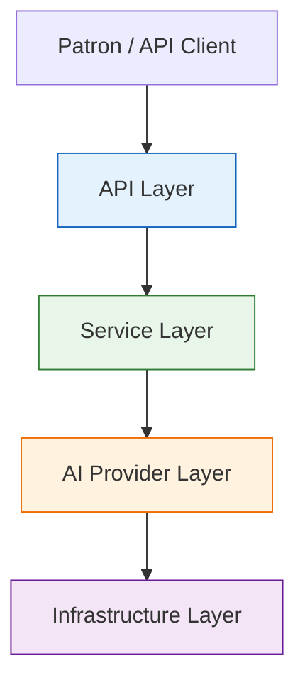

# LibraryMind
#  LibraryMind: An Intelligent Library Assistant

LibraryMind is an AI-powered backend service designed for public libraries. Moving beyond rigid keyword matching, LibraryMind provides patrons with a deeply cognitive interface capable of semantic search, context-grounded retrieval-augmented generation (RAG), stateful conversational memory management, structured ticket classification, and bulk sentiment review analysis.

The system is built from the ground up prioritizing absolute resilience, data integrity, and high-performance execution patterns.

---

##  System Architecture

The application implements a decoupled, four-tier layered architecture to isolate responsibilities, maximize system throughput, and ensure independent testability across modules.
## Architecture



###  Architectural Blueprint
* **Layer 1: API Layer (FastAPI):** Exposes high-performance, asynchronous REST endpoints with zero embedded business logic. Enforces strict input schema compilation via Pydantic.
* **Layer 2: Service Layer:** Houses the core orchestration processing engines—including the sliding-window conversational chat memory tracker, multi-sentence semantic embedder, and text formatting wrappers.
* **Layer 3: AI Provider Layer:** Implements vendor abstraction with automatic cascading failovers (AmaliTech OpenAI-compatible production environment, Anthropic Claude, Google Gemini) alongside internal exponential backoff with jitter loops.
* **Layer 4: Infrastructure Layer:** Low-latency storage and guardrails utilizing **ChromaDB** for vector operations, **Redis** for deterministic response caching, and a thread-safe token-bucket controller for rate-limiting.

---

##  Production-Grade Optimizations

To stand out from baseline AI wrappers, LibraryMind integrates core optimizations used by engineering teams building real-world software products:

* **Dual-Tier Deterministic Caching:** Caches both raw embedding vectors and full semantic responses using `SHA-256` payload hashing. This drastically minimizes latency and prevents duplicate downstream billing.
* **Graceful Degradation Circuit:** The application treats caching as a non-blocking enhancement. If the Redis server experiences localized downtime, the infrastructure layer degrades safely to an in-memory pass-through without dropping requests.
* **Token-Driven Sliding Windows:** To completely avoid `ContextWindowOverflow` errors, chatbot session memory is calculated iteratively on every turn using precise tokenizer weights (`tiktoken`) instead of fixed message limits.
* **Defensive Schema Parsing:** Combats conversational AI variability by passing JSON responses through regex code fence strip filters (` ```json ... ``` `) before schema hydration.

---

##  Main Feature Modules

1. **Semantic Catalogue Search (`/search/books`):** Concept-driven lookup mapping question intents to historical collections via cosine similarity metrics.
2. **Retrieval-Augmented Q&A (`/search/ask`):** Grounded answering system with book citations, enforced by rigid relevance boundaries to prevent hallucinations.
3. **Conversational Librarian (`/chat`):** Warm, personalized multi-turn interaction interface tracking independent persistent sessions.
4. **Support Ticket Triage (`/classify/ticket`):** Real-time, low-temperature semantic extraction analyzing category, priority, and sentiment of text incoming queries.
5. **Review Synthesis (`/summarise/reviews`):** Aggregates up to 50 user-generated reviews into atomic points of praise and criticism.

---

##  Environment Configuration

The backend reads configuration settings directly from environment layers. Create a `.env` file in the root workspace folder:

```env
# AI Gateway Provisioning
PRIMARY_PROVIDER=openai
AMALITECH_API_KEY=your_production_api_key_here
OPENAI_API_BASE=API_link_here
# Infrastructure Controls
REDIS_HOST=localhost
REDIS_PORT=6379
RATE_LIMIT_PER_MINUTE=60
RELEVANCE_THRESHOLD=0.70
Quick Start (Local Setup)
Prerequisites
Python 3.10 or higher

Redis Server (Optional, server falls back safely if unavailable)

1. Initialize Virtual Environment & Install Dependencies
Bash
python3 -m venv venv
source venv/bin/activate  # On Windows use: venv\Scripts\activate
pip install -r requirements.txt
2. Seed Vector Database
Populate the ChromaDB local engine with the catalog profile library:

Bash
python seed.py
3. Run Development Server
Bash
uvicorn app.main:app --reload
Once running, check out the interactive Swagger documentation interface at http://127.0.0.1:8000/docs.
